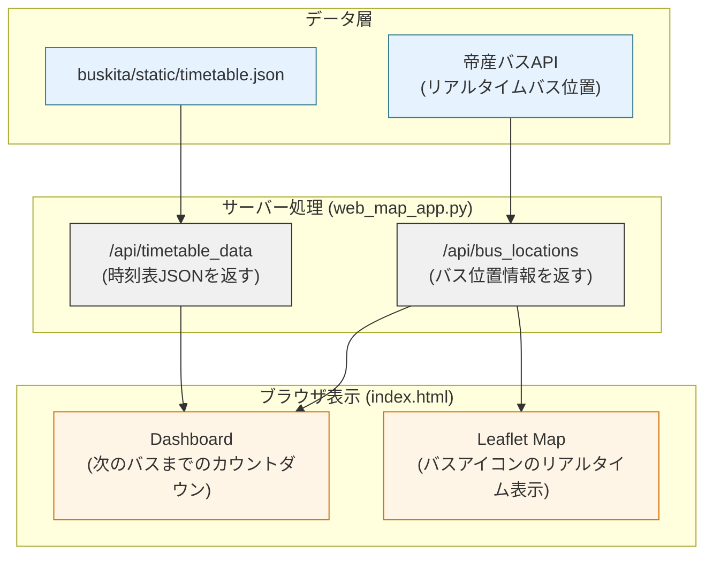

# アプリケーション データフロー

このドキュメントは、「Ryukoku Bus Navi」の主要なデータの流れを図示したものです。

## データフロー図

```mermaid
graph TD
    subgraph "データ層"
        A["buskita/static/timetable.json"]
        B["帝産バスAPI<br/>(リアルタイムバス位置)"]
    end

    subgraph "サーバー処理 (web_map_app.py)"
        C["/api/timetable_data<br/>(時刻表JSONを返す)"]
        D["/api/bus_locations<br/>(バス位置情報を返す)"]
    end
    
    subgraph "ブラウザ表示 (index.html)"
        E["Dashboard<br/>(次のバスまでのカウントダウン)"]
        F["Leaflet Map<br/>(バスアイコンのリアルタイム表示)"]
    end

    A --> C
    B --> D
    
    C --> E
    D --> E
    D --> F

    style A fill:#e6f3ff,stroke:#367d91
    style B fill:#e6f3ff,stroke:#367d91
    style C fill:#f0f0f0,stroke:#333
    style D fill:#f0f0f0,stroke:#333
    style E fill:#fff5e6,stroke:#d46f00
    style F fill:#fff5e6,stroke:#d46f00
``` 